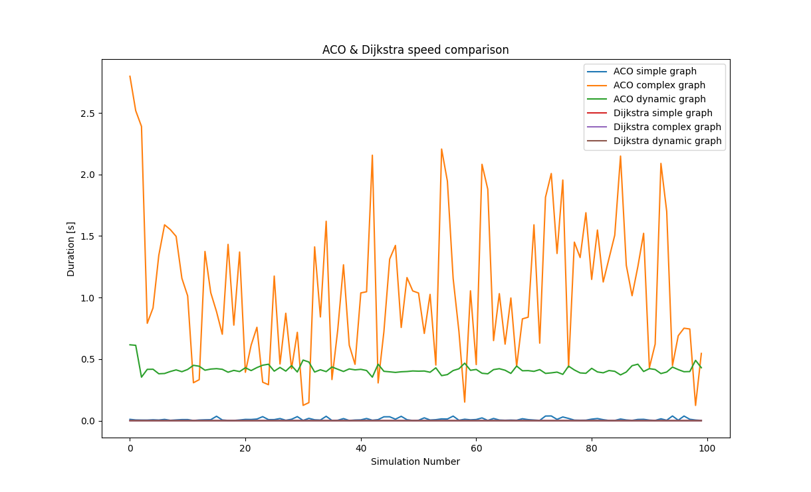

# Comparison: Ant-Colony-Optimization and Dijkstra's Algorithm

### Introduction

This repository includes my implementation of ACO (Ant Colony Optimization) 
and Dijkstra's Algorithm, they are compared on speed, ACO needs to find the 
perfect solution (±2 cm) or terminates after a specific iteration.

### Results

This shows the duration which the different algorithms take to compute
the shortest path in different mazes. Those can be found at the [graph.py](graph.py)
file.
